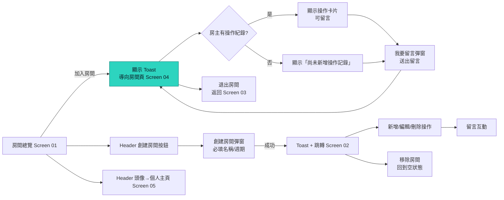

# frankapp - 股神俱樂部功能頁原型

這是一個純前端的功能頁原型，模擬「股神俱樂部」APP 的主要體驗，包括房間總覽、我創建的房間、我加入的房間、訪客房間頁，以及個人主頁。所有資料都保存在瀏覽器記憶體中，方便快速展示流程。

## 使用方式
1. 將專案下載後，以瀏覽器直接開啟 `index.html`。
2. 透過底部分頁或 Header 進行導覽，體驗各項功能：
   - 在房間總覽加入房間並觸發「加入成功」的 toast。
   - 點擊「創建房間」彈窗建立自己的房間，自動跳轉到「我創建的房間」。
   - 在「我創建的房間」新增/編輯/刪除操作記錄、留言與移除房間。
   - 在「我加入的房間」或總覽進入房間訪客頁，留言與退出房間。
   - 於個人主頁檢視暱稱、創建與加入的房間清單。

## 檔案說明
- `index.html`：頁面骨架與彈窗結構。
- `styles.css`：深色系介面與卡片、按鈕、彈窗的樣式設定。
- `app.js`：前端互動邏輯、資料管理、導覽與 toast/彈窗控制。

## 資料庫設計（實際上可由後端實作）
以下為對應目前功能頁的關聯式資料表，型別以常見的 PostgreSQL 風格描述，可依實際後端調整：

### 資料表
| Table | 目的 | 主要欄位 |
| --- | --- | --- |
| `users` | 儲存使用者資訊與暱稱 | `id (PK, uuid)`, `email (unique)`, `password_hash`, `nickname`, `avatar_url`, `created_at`, `updated_at` |
| `rooms` | 房間主檔 | `id (PK, uuid)`, `name (varchar)`, `cycle (enum: short, mid, long, value)`, `intro (text)`, `owner_id (FK -> users.id)`, `member_count (int, default 1)`, `created_at`, `updated_at` |
| `room_members` | 房間成員（包含房主） | `id (PK, uuid)`, `room_id (FK -> rooms.id)`, `user_id (FK -> users.id)`, `role (enum: owner, member)`, `joined_at` |
| `operations` | 操作記錄 | `id (PK, uuid)`, `room_id (FK -> rooms.id)`, `actor_id (FK -> users.id)`, `stock_code (varchar)`, `stock_name (varchar)`, `shares (int)`, `action (enum: buy, add, trim, sell)`, `note (text)`, `happened_on (date)`, `created_at`, `updated_at` |
| `operation_comments` | 對操作卡片留言 | `id (PK, uuid)`, `operation_id (FK -> operations.id)`, `user_id (FK -> users.id)`, `content (text)`, `created_at` |
| `room_comments` | 對房間層級留言（若未來需要） | `id (PK, uuid)`, `room_id (FK -> rooms.id)`, `user_id (FK -> users.id)`, `content (text)`, `created_at` |

### ER 流程摘要
- `users` 與 `rooms`：`rooms.owner_id` 指向房主；房主也會在 `room_members` 中擁有一筆 `role=owner` 的紀錄。
- `room_members` 對應使用者加入/退出房間的流程，`member_count` 可由觸發器或 API 層在加入/退出時更新。
- `operations` 連結房間與操作發起者，供房主在 Screen 02/04 管理操作記錄。
- `operation_comments` 儲存留言，顯示在各操作卡片下方；若需房間層留言可使用 `room_comments`。

## API 設計（範例草案）
以下端點以 REST 風格描述，可搭配 JWT/Session 驗證（未詳述認證流程）。

### 房間與導覽
- `GET /rooms?excludeOwned=true&sort=member_desc`：房間總覽（預設不含自己創建的房間、可依人數排序）。
- `POST /rooms`：創建房間，body：`{name, cycle, intro}`，回傳新房間並將使用者加入 `room_members`。
- `GET /rooms/owned`：我創建的房間列表（含房間詳細與操作記錄）。
- `GET /rooms/joined`：我加入的房間列表。
- `GET /rooms/{roomId}`：房間詳情（人數、操作記錄、留言）。
- `DELETE /rooms/{roomId}`：房主移除房間，連帶刪除操作與留言。

### 加入 / 退出
- `POST /rooms/{roomId}/join`：加入房間，建立 `room_members` 紀錄並更新 `rooms.member_count`。
- `POST /rooms/{roomId}/leave`：退出房間，移除成員並更新人數。

### 操作記錄（房主限定）
- `POST /rooms/{roomId}/operations`：新增操作記錄，body：`{stock_code, stock_name, shares, action, note, happened_on}`。
- `PATCH /operations/{opId}`：編輯操作記錄。
- `DELETE /operations/{opId}`：刪除操作記錄。

### 留言（房主與訪客皆可）
- `POST /operations/{opId}/comments`：在操作卡片留言，body：`{content}`。
- `GET /operations/{opId}/comments`：取得該操作的留言串。
- `DELETE /operation-comments/{commentId}`：刪除留言（可依權限限制只有作者或房主）。

### 個人主頁
- `GET /me`：取得暱稱、創建的房間與加入的房間清單。
- `PATCH /me`：更新暱稱或頭像。

## 系統架構圖（Workflow）
以下以高層級 workflow 描繪前端操作、API 與資料層的互動，附註解說明主要節點：

```mermaid
flowchart TD
    subgraph Client[前端 Web / PWA]
        UI[功能頁面\n(Screen 01~05)]
        State[前端狀態儲存\n(記憶體/快取)]
        Toast[Toast & Modal]
    end

    subgraph API[後端 API 層]
        RoomAPI[Room API\n(房間列表/創建/加入/退出/刪除)]
        OpAPI[Operation API\n(新增/編輯/刪除操作、留言)]
        ProfileAPI[Profile API\n(個人主頁、暱稱/頭像更新)]
    end

    subgraph DB[資料庫]
        Users[(users)]
        Rooms[(rooms)]
        Members[(room_members)]
        Ops[(operations)]
        OpCmt[(operation_comments)]
    end

    UI -- 切換分頁/點擊按鈕 --> Toast
    UI -- 觸發動作 --> State
    UI -- REST 請求 --> RoomAPI
    UI -- REST 請求 --> OpAPI
    UI -- REST 請求 --> ProfileAPI

    RoomAPI -- 新增/更新/查詢 --> Rooms
    RoomAPI -- 維護成員數/關聯 --> Members
    RoomAPI -- 房主與成員對應 --> Users

    OpAPI -- 寫入/更新 --> Ops
    OpAPI -- 留言 CRUD --> OpCmt
    OpAPI -- 操作與留言作者 --> Users
    OpAPI -- 操作隸屬房間 --> Rooms

    ProfileAPI -- 讀寫暱稱/頭像 --> Users
    ProfileAPI -- 我的房間/加入房間清單 --> Members

    Toast -- 成功/錯誤提示 --> UI
    State -- 同步列表/卡片狀態 --> UI

    classDef note fill:#223,stroke:#4fc3f7,color:#fff,stroke-width:1px;
    class Toast note;
```

### 註解
- **前端 Web/PWA**：對應目前的多頁籤 UI；所有操作都會先更新前端狀態，並顯示 toast/modal 互動。
- **API 層**：以 REST 端點包裝房間、操作紀錄、留言與個人資訊的讀寫，處理商業邏輯（如成員數維護、權限）。
- **資料庫**：使用 `users`、`rooms`、`room_members`、`operations`、`operation_comments` 等表格對應前述資料庫設計。
- **資料流**：例如在房間總覽點擊「加入房間」，前端發送 `POST /rooms/{id}/join`，API 寫入 `room_members` 並更新 `rooms.member_count`，回傳成功後前端同步狀態並顯示 toast，同時導向房間訪客頁。

## User Journey（端到端行為路徑）
以下描述一位使用者第一次開啟頁面到完整體驗所有核心功能的旅程：
1. **進入首頁（房間總覽 Screen 01）**：瀏覽公開房間卡片、使用排序快速找到熱門房間。
2. **加入房間**：點擊卡片右下角「加入房間」，立即看到 toast 成功提示並自動導向該房間的訪客頁（Screen 04）。
3. **查看房主操作記錄**：在訪客頁瀏覽最新三筆股票操作與描述，若無資料顯示「尚未新增操作記錄」。
4. **留言互動**：對任何操作卡片點擊「我要留言」，在彈窗輸入評論並送出，留言會顯示在卡片下方。
5. **退出房間**：使用左下角「退出房間」按鈕返回「我加入的房間」列表（Screen 03），確認清單已更新。
6. **創建屬於自己的房間**：回到 Header 的「創建房間」按鈕，填寫名稱、操作週期與介紹，成功 toast 後跳轉到「我創建的房間」（Screen 02）。
7. **管理操作記錄**：在「我創建的房間」新增/編輯/刪除操作、留下說明與留言，並可在需要時使用「移除房間」清空整體資料。
8. **檢視個人資訊**：點擊 Header 頭像前往個人主頁（Screen 05），查看暱稱、創建與加入的房間列表，驗證資料同步無誤。

## Screen 說明（01~05）
- **Screen 01｜房間總覽（預設首頁）**
  - 以卡片列出所有可加入的房間（排除自己創建的房間）。
  - 顯示房間名稱、房主暱稱、房間人數、操作週期，以及依日期新→舊的前三筆操作標的。
  - 右上可切換排序（房間人數由多到少）。
  - 卡片右下角提供「加入房間」按鈕；加入後會顯示 toast，並將按鈕轉為「進入房間」。

- **Screen 02｜我創建的房間**
  - 未創建時顯示空狀態提示；創建後呈現房名、房間人數與操作清單。
  - 可新增/編輯/刪除操作記錄（包含股票代號、名稱、張數、日期、操作類型、說明）。
  - 每筆操作卡片下方可留言；留言會立即出現在對應卡片。
  - 支援移除整個房間，移除後回到空狀態畫面。

- **Screen 03｜我加入的房間**
  - 以卡片呈現所有已加入的房間（不含自己創建的房間）。
  - 顯示與房間總覽相同的欄位與排序功能。
  - 卡片右下角提供「進入房間」按鈕，導向訪客房間頁（Screen 04）。

- **Screen 04｜房間頁-訪客**
  - 顯示房間名稱與人數，並呈現房主的操作記錄；若無資料則顯示空狀態。
  - 可對每筆操作卡片留言；送出後立即附加到卡片留言區。
  - 左下角有「退出房間」按鈕，點擊確認後返回「我加入的房間」。

- **Screen 05｜個人主頁**
  - 展示使用者暱稱、創建的房間名稱列表與加入的房間（含房主暱稱）；若沒有則顯示「無」。
  - 從 Header 頭像進入，便於確認個人關聯房間概況。

## 功能 User Story（以核心角色：一般使用者）
- **瀏覽房間**：身為使用者，我想在房間總覽看到熱門與最新房間，方便挑選我要加入的討論區。接受條件：卡片顯示名稱、房主暱稱、人數、操作週期與前三筆標的；可依人數排序。
- **加入房間並立即查看內容**：身為使用者，我想在點擊「加入房間」後立即進入該房間頁，並收到成功提示，同時人數自動更新並記錄在「我加入的房間」。
- **查看與留言操作紀錄**：身為房間成員，我想在訪客頁閱讀房主的每筆操作並留言回饋，以便討論投資決策。接受條件：操作卡片含代號、名稱、張數、日期、操作類型、說明；留言送出後顯示在卡片下方。
- **退出房間**：身為房間成員，我可以透過左下角按鈕退出房間並返回加入列表，清單需同步移除該房間且人數扣回。
- **創建與管理房間**：身為房主，我想創建房間並管理操作紀錄（新增、編輯、刪除）及留言，讓成員能即時看到我的操作脈絡。接受條件：創建必填名稱與操作週期；操作卡片可重複編輯；移除房間會清空相關資料並回到空狀態頁。
- **新增操作留言**：身為房主或成員，我想對每筆操作留下留言，以便紀錄討論重點，送出後留言需即時顯示於對應卡片。
- **查看個人主頁**：身為使用者，我想快速看到自己的暱稱、創建的房間與加入的房間，缺少資料時顯示「無」，以確認當前身份與關聯房間。

## FlowChart（主要互動流程）
以下流程圖聚焦於「加入房間 → 瀏覽/留言 → 創建房間」的主要動線：



## 功能描述彙整（用戶端 & 系統端）

### 功能描述＿用戶端
- 在【房間總覽 Screen 01】中，用戶在【瀏覽公開房間卡片並可依人數排序】下，可以【點擊「加入房間」立即顯示成功 Toast 並導向訪客頁】才能達成【快速加入感興趣的房間並確認加入成功】的目標。
- 在【我創建的房間 Screen 02】中，用戶在【完成創建並進入房主管理介面】下，可以【新增/編輯/刪除操作記錄、回覆留言或移除整個房間】才能達成【維護與更新自己的投資房間內容】的目標。
- 在【我加入的房間 Screen 03】中，用戶在【已加入房間的列表】下，可以【查看房間摘要並點擊「進入房間」導向訪客頁】才能達成【回訪已加入房間並持續參與】的目標。
- 在【房間頁-訪客 Screen 04】中，用戶在【房主操作記錄與留言串】下，可以【瀏覽操作細節、留言互動或點擊「退出房間」返回加入列表】才能達成【在房間內參與討論並保持名單同步】的目標。
- 在【個人主頁 Screen 05】中，用戶在【個人資料總覽】下，可以【查看暱稱、自己創建的房間與加入的房間】才能達成【確認個人身份與房間關聯概況】的目標。

### 功能描述＿系統端
- **房間與成員維護**：API 需在創建、加入、退出與移除房間時，寫入/更新 `rooms`、`room_members` 並正確調整 `member_count`，避免重複加入並同步回傳最新人數給前端。
- **操作記錄服務**：提供房主限定的操作 CRUD（`operations`），驗證必填欄位與日期格式，並在編輯/刪除後回傳最新列表以更新房主頁與訪客頁。
- **留言服務**：管理操作卡片留言（`operation_comments`），維護作者與時間戳，必要時提供刪除權限檢查，確保前端可即時呈現送出的留言。
- **導覽與狀態同步**：對加入房間等核心動作回傳狀態（成功/失敗）、最新房間摘要與成員清單，讓前端能在顯示 toast 的同時導向正確頁面並更新列表/個人主頁。
- **安全與效能考量**：在 API 層加入驗證、權限檢查、速率限制與快取（如房間列表排序），避免因頻繁操作造成併發錯誤或資料不一致。
