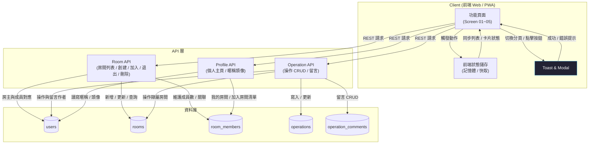

# frankapp - 股神俱樂部功能頁原型

這是一個純前端的功能頁原型，模擬「股神俱樂部」APP 的主要體驗，包括房間總覽、我創建的房間、我加入的房間、訪客房間頁，以及個人主頁。所有資料都保存在瀏覽器記憶體中，方便快速展示流程。

## 使用方式
1. 將專案下載後，以瀏覽器直接開啟 `index.html`。
2. 透過底部分頁或 Header 進行導覽，體驗各項功能：
   - 在房間總覽加入房間並觸發「加入成功」的 toast。
   - 點擊「創建房間」彈窗建立自己的房間，自動跳轉到「我創建的房間」。
   - 在「我創建的房間」新增/編輯/刪除操作記錄、留言與移除房間。
   - 在「我加入的房間」或總覽進入房間訪客頁，留言與退出房間。
   - 於個人主頁檢視暱稱、創建與加入的房間清單。

## 檔案說明
- `index.html`：頁面骨架與彈窗結構。
- `styles.css`：深色系介面與卡片、按鈕、彈窗的樣式設定。
- `app.js`：前端互動邏輯、資料管理、導覽與 toast/彈窗控制。

## 資料庫設計（實際上可由後端實作）
以下為對應目前功能頁的關聯式資料表，型別以常見的 PostgreSQL 風格描述，可依實際後端調整：

### 資料表
| Table | 目的 | 主要欄位 |
| --- | --- | --- |
| `users` | 儲存使用者資訊與暱稱 | `id (PK, uuid)`, `email (unique)`, `password_hash`, `nickname`, `avatar_url`, `created_at`, `updated_at` |
| `rooms` | 房間主檔 | `id (PK, uuid)`, `name (varchar)`, `cycle (enum: short, mid, long, value)`, `intro (text)`, `owner_id (FK -> users.id)`, `member_count (int, default 1)`, `created_at`, `updated_at` |
| `room_members` | 房間成員（包含房主） | `id (PK, uuid)`, `room_id (FK -> rooms.id)`, `user_id (FK -> users.id)`, `role (enum: owner, member)`, `joined_at` |
| `operations` | 操作記錄 | `id (PK, uuid)`, `room_id (FK -> rooms.id)`, `actor_id (FK -> users.id)`, `stock_code (varchar)`, `stock_name (varchar)`, `shares (int)`, `action (enum: buy, add, trim, sell)`, `note (text)`, `happened_on (date)`, `created_at`, `updated_at` |
| `operation_comments` | 對操作卡片留言 | `id (PK, uuid)`, `operation_id (FK -> operations.id)`, `user_id (FK -> users.id)`, `content (text)`, `created_at` |
| `room_comments` | 對房間層級留言（若未來需要） | `id (PK, uuid)`, `room_id (FK -> rooms.id)`, `user_id (FK -> users.id)`, `content (text)`, `created_at` |

### ER 流程摘要
- `users` 與 `rooms`：`rooms.owner_id` 指向房主；房主也會在 `room_members` 中擁有一筆 `role=owner` 的紀錄。
- `room_members` 對應使用者加入/退出房間的流程，`member_count` 可由觸發器或 API 層在加入/退出時更新。
- `operations` 連結房間與操作發起者，供房主在 Screen 02/04 管理操作記錄。
- `operation_comments` 儲存留言，顯示在各操作卡片下方；若需房間層留言可使用 `room_comments`。

## API 設計（範例草案）
以下端點以 REST 風格描述，可搭配 JWT/Session 驗證（未詳述認證流程）。

### 房間與導覽
- `GET /rooms?excludeOwned=true&sort=member_desc`：房間總覽（預設不含自己創建的房間、可依人數排序）。
- `POST /rooms`：創建房間，body：`{name, cycle, intro}`，回傳新房間並將使用者加入 `room_members`。
- `GET /rooms/owned`：我創建的房間列表（含房間詳細與操作記錄）。
- `GET /rooms/joined`：我加入的房間列表。
- `GET /rooms/{roomId}`：房間詳情（人數、操作記錄、留言）。
- `DELETE /rooms/{roomId}`：房主移除房間，連帶刪除操作與留言。

### 加入 / 退出
- `POST /rooms/{roomId}/join`：加入房間，建立 `room_members` 紀錄並更新 `rooms.member_count`。
- `POST /rooms/{roomId}/leave`：退出房間，移除成員並更新人數。

### 操作記錄（房主限定）
- `POST /rooms/{roomId}/operations`：新增操作記錄，body：`{stock_code, stock_name, shares, action, note, happened_on}`。
- `PATCH /operations/{opId}`：編輯操作記錄。
- `DELETE /operations/{opId}`：刪除操作記錄。

### 留言（房主與訪客皆可）
- `POST /operations/{opId}/comments`：在操作卡片留言，body：`{content}`。
- `GET /operations/{opId}/comments`：取得該操作的留言串。
- `DELETE /operation-comments/{commentId}`：刪除留言（可依權限限制只有作者或房主）。

### 個人主頁
- `GET /me`：取得暱稱、創建的房間與加入的房間清單。
- `PATCH /me`：更新暱稱或頭像。

## 系統架構圖（Workflow）
以下以高層級 workflow 描繪前端操作、API 與資料層的互動，附註解說明主要節點：

  
### 註解
- **前端 Web/PWA**：對應目前的多頁籤 UI；所有操作都會先更新前端狀態，並顯示 toast/modal 互動。
- **API 層**：以 REST 端點包裝房間、操作紀錄、留言與個人資訊的讀寫，處理商業邏輯（如成員數維護、權限）。
- **資料庫**：使用 `users`、`rooms`、`room_members`、`operations`、`operation_comments` 等表格對應前述資料庫設計。
- **資料流**：例如在房間總覽點擊「加入房間」，前端發送 `POST /rooms/{id}/join`，API 寫入 `room_members` 並更新 `rooms.member_count`，回傳成功後前端同步狀態並顯示 toast，同時導向房間訪客頁。
