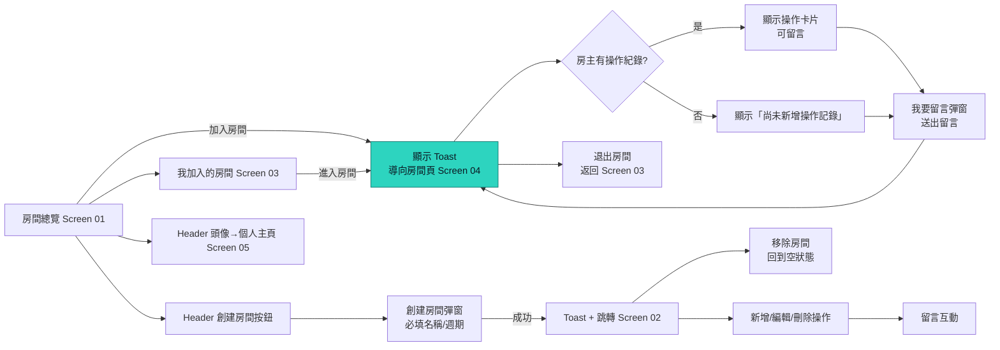

# frankapp - 股神俱樂部功能頁原型

這是一個純前端的功能頁原型，模擬「股神俱樂部」APP 的主要體驗，包括房間總覽、我創建的房間、我加入的房間、訪客房間頁，以及個人主頁。所有資料都保存在瀏覽器記憶體中，方便快速展示流程。

## 使用方式（前端原型）
1. 將專案下載後，以瀏覽器直接開啟 `index.html`。
2. 透過底部分頁或 Header 進行導覽，體驗各項功能：
   - 在房間總覽加入房間並觸發「加入成功」的 toast。
   - 點擊「創建房間」彈窗建立自己的房間，自動跳轉到「我創建的房間」。
   - 在「我創建的房間」新增/編輯/刪除操作記錄、留言與移除房間。
   - 在「我加入的房間」或總覽進入房間訪客頁，留言與退出房間。
   - 於個人主頁檢視暱稱、創建與加入的房間清單。

## 前端佈局問題與解法（滑動時的固定 Header / 底部選單）
- **問題 1：頂部 Header 固定時覆蓋內容，卡片最上方資訊被遮住，且無法滑到真正頂端。**  
  **解法：** 在 `styles.css` 設定 `--topbar-height`，並精簡 `.app-shell` 上方內距為 `calc(var(--topbar-height) + 8px)`，同步收斂 `.page-layout__content` 的 `padding-top` 與 `scroll-padding-top`，確保能滑到內容起點、不被 Header 壓住且不留過多空白。
- **問題 2：底部選單未固定，滾動時消失或遮蓋內容。**  
  **解法：** 透過 `--tabbar-height` 固定 `.tab-bar` 在視窗底部，並為外層 `.app-shell` 與 `.page-layout__content` 增加對應的下方內距，同時微調 FAB 的底部間距，使內容可完整捲動又不被底部選單覆蓋。  
> 以上修正均為純樣式調整，前後端邏輯未變動，滑動時 Header 與底部導覽皆維持在視窗內且不會跑版。

## 檔案說明
- `index.html`：頁面骨架與彈窗結構。
- `styles.css`：深色系介面與卡片、按鈕、彈窗的樣式設定。
- `app.js`：前端互動邏輯、資料管理、導覽與 toast/彈窗控制。

## Backend（SQLite 版極簡實作）
> 針對「主機條件有限」的需求，提供一個依賴極少、容易在 CI/CD 或低規環境啟動的 Node.js + SQLite 後端原型。

### 架構與檔案
- `backend/server.js`：Express 應用主程式，負責啟動服務、套用路由、錯誤處理。
- `backend/package.json`：定義最小相依（`express`、`sqlite3`）、執行指令與 Node 版本需求。
- `backend/data.sqlite`：啟動後自動建立的資料檔案，不需要額外安裝資料庫伺服器。

### 資料表（SQLite）
啟動時會自動建立以下表格，欄位對應前端功能：
- `users`：使用者主檔（預設自動建立 1 位 demo 用戶）。
- `rooms`：房間主檔，包含 `cycle`、`intro`、`member_count` 等欄位。
- `room_members`：房間成員關聯，維護角色與成員數。
- `operations`：操作計畫（股票代碼、名稱、日期、倉位配置%、進場條件、進場價格區間、加碼/止損/停利條件、目標價、備註）。
- `operation_comments`：操作留言，關聯操作與留言作者。

### 路由摘要
- `GET /health`：健康檢查。
- `GET /rooms`：房間列表，可用 `excludeOwned=1` 過濾自有房間、`sort=member_desc` 依人數排序。
- `POST /rooms`：創建房間並把呼叫者加入為房主。
- `GET /rooms/owned`、`GET /rooms/joined`：分別取得自己創建與加入的房間。
- `POST /rooms/:id/join` / `POST /rooms/:id/leave` / `DELETE /rooms/:id`：加入、退出、移除房間（移除僅限房主）。
- `GET /rooms/:id`：房間詳情，包含操作與留言串。
- `POST /rooms/:id/operations`、`PATCH /operations/:id`、`DELETE /operations/:id`：操作記錄 CRUD。
- `POST /operations/:id/comments`：針對操作卡片留言。

### 使用方式（後端）
1. 安裝 Node.js（建議 LTS 18+）與 npm。低規環境僅需能執行 Node，不需額外 DB 服務。
2. 在專案根目錄執行：
   ```bash
   cd backend
   npm install
   npm start  # 預設 http://localhost:4000
   ```
3. 請求時可透過 `x-user-id` header 指定使用者 ID（預設 1）；第一次啟動會自動建立 demo 用戶與兩個示範房間。
4. SQLite 資料檔預設位於 `backend/data.sqlite`，若需要重新初始化可刪除該檔後重新啟動。

### 環境限制與 CI/CD 提示
- **極少相依**：僅 `express` 與 `sqlite3` 兩個套件；無需安裝系統級 SQLite 伺服器或其他服務。
- **資源友善**：SQLite 檔案型資料庫適合低 RAM / CPU 主機；如需併發更高的部署可替換為 Postgres，路由格式相容。
- **預設授權簡化**：未實作完整驗證，使用 `x-user-id` 模擬登入；正式環境需接入 JWT/Session 與權限檢查。
- **遷移策略**：若未來改用雲端 DB，請在 CI/CD 先執行資料庫遷移，並以環境變數提供連線字串；目前版本不依賴外部服務即可通過基本健康檢查。

## 資料庫設計（實際上可由後端實作）
以下為對應目前功能頁的關聯式資料表，型別以常見的 PostgreSQL 風格描述，可依實際後端調整：

### 資料表
| Table | 目的 | 主要欄位 |
| --- | --- | --- |
| `users` | 儲存使用者資訊與暱稱 | `id (PK, uuid)`, `email (unique)`, `password_hash`, `nickname`, `avatar_url`, `created_at`, `updated_at` |
| `rooms` | 房間主檔 | `id (PK, uuid)`, `name (varchar)`, `cycle (enum: short, mid, long, value)`, `intro (text)`, `owner_id (FK -> users.id)`, `member_count (int, default 1)`, `created_at`, `updated_at` |
| `room_members` | 房間成員（包含房主） | `id (PK, uuid)`, `room_id (FK -> rooms.id)`, `user_id (FK -> users.id)`, `role (enum: owner, member)`, `joined_at` |
| `operations` | 操作計畫 | `id (PK, uuid)`, `room_id (FK -> rooms.id)`, `actor_id (FK -> users.id)`, `stock_code (varchar)`, `stock_name (varchar)`, `plan_date (date)`, `position_pct (numeric)`, `entry_condition (text)`, `entry_range_min (numeric)`, `entry_range_max (numeric)`, `add_condition (text)`, `stop_loss_condition (text)`, `take_profit_condition (text)`, `target_price (numeric)`, `note (text)`, `created_at`, `updated_at` |
| `operation_comments` | 對操作卡片留言 | `id (PK, uuid)`, `operation_id (FK -> operations.id)`, `user_id (FK -> users.id)`, `content (text)`, `created_at` |
| `room_comments` | 對房間層級留言（若未來需要） | `id (PK, uuid)`, `room_id (FK -> rooms.id)`, `user_id (FK -> users.id)`, `content (text)`, `created_at` |

### ER 流程摘要
- `users` 與 `rooms`：`rooms.owner_id` 指向房主；房主也會在 `room_members` 中擁有一筆 `role=owner` 的紀錄。
- `room_members` 對應使用者加入/退出房間的流程，`member_count` 可由觸發器或 API 層在加入/退出時更新。
- `operations` 連結房間與操作發起者，供房主在 Screen 02/04 管理操作記錄。
- `operation_comments` 儲存留言，顯示在各操作卡片下方；若需房間層留言可使用 `room_comments`。

## API 設計（範例草案）
以下端點以 REST 風格描述，可搭配 JWT/Session 驗證（未詳述認證流程）。

### 房間與導覽
- `GET /rooms?excludeOwned=true&sort=member_desc`：房間總覽（預設不含自己創建的房間、可依人數排序）。
- `POST /rooms`：創建房間，body：`{name, cycle, intro}`，回傳新房間並將使用者加入 `room_members`。
- `GET /rooms/owned`：我創建的房間列表（含房間詳細與操作記錄）。
- `GET /rooms/joined`：我加入的房間列表。
- `GET /rooms/{roomId}`：房間詳情（人數、操作記錄、留言）。
- `DELETE /rooms/{roomId}`：房主移除房間，連帶刪除操作與留言。

### 加入 / 退出
- `POST /rooms/{roomId}/join`：加入房間，建立 `room_members` 紀錄並更新 `rooms.member_count`。
- `POST /rooms/{roomId}/leave`：退出房間，移除成員並更新人數。

### 操作計畫（房主限定）
- `POST /rooms/{roomId}/operations`：新增操作計畫，body：`{stock_code, stock_name, plan_date, position_pct, entry_condition, entry_range_min, entry_range_max, add_condition, stop_loss_condition, take_profit_condition, target_price, note}`。
- `PATCH /operations/{opId}`：編輯操作計畫（欄位同上）。
- `DELETE /operations/{opId}`：刪除操作計畫。

### 留言（房主與訪客皆可）
- `POST /operations/{opId}/comments`：在操作卡片留言，body：`{content}`。
- `GET /operations/{opId}/comments`：取得該操作的留言串。
- `DELETE /operation-comments/{commentId}`：刪除留言（可依權限限制只有作者或房主）。

### 個人主頁
- `GET /me`：取得暱稱、創建的房間與加入的房間清單。
- `PATCH /me`：更新暱稱或頭像。

## 系統架構圖（Workflow）
以下以高層級 workflow 描繪前端操作、API 與資料層的互動，並標示關鍵資料流：

```mermaid
flowchart LR
    subgraph Client[前端 Web / PWA]
        Nav[Header + Bottom Tab]
        Screens[Screen 01~05\n房間/操作計畫/個人主頁]
        UIState[前端狀態\n(記憶體/快取)]
        Feedback[Toast / Modal]
    end

    subgraph API[後端 API 層]
        RoomAPI[Rooms API\n列表/創建/加入/退出/刪除]
        PlanAPI[Operations API\n操作計畫 CRUD]
        CommentAPI[Comments API\n操作留言]
        ProfileAPI[Profile API\n個人資訊]
    end

    subgraph DB[SQLite / RDB]
        Users[(users)]
        Rooms[(rooms)]
        Members[(room_members)]
        Plans[(operations)]
        PlanComments[(operation_comments)]
    end

    Nav --> Screens
    Screens --> UIState
    Screens --> Feedback

    Screens -- REST /rooms /rooms/:id --> RoomAPI
    Screens -- REST --> PlanAPI
    Screens -- REST --> CommentAPI
    Screens -- REST --> ProfileAPI

    RoomAPI --> Rooms
    RoomAPI --> Members
    RoomAPI --> Users

    PlanAPI --> Plans
    PlanAPI --> Rooms
    PlanAPI --> Users

    CommentAPI --> PlanComments
    CommentAPI --> Plans
    CommentAPI --> Users

    ProfileAPI --> Users
    ProfileAPI --> Members
```

### 註解
- **前端層**：Header/底部分頁切換 Screen 01~05；所有操作先更新 UIState，再觸發 API。
- **API 層**：按資源拆分 Rooms / Operations / Comments / Profile，負責資料一致性與權限控制（房主 vs 訪客）。
- **資料層**：核心表包含 `users`、`rooms`、`room_members`、`operations`、`operation_comments`，支援房間關係、計畫與留言串聯。
- **資料流範例**：
  - 加入房間：房間總覽點擊「加入房間」→ `POST /rooms/{id}/join` → 寫入 `room_members` 並更新 `rooms.member_count` → UIState 同步、Toast 顯示並導航至訪客房間頁。
  - 進入已加入房間：我加入的房間點擊「進入房間」→ `GET /rooms/{id}` 取得房間詳情與操作計畫 → UIState 更新並導向訪客房間頁。

## User Journey（端到端行為路徑）
以下描述一位使用者第一次開啟頁面到完整體驗所有核心功能的旅程：
1. **進入首頁（房間總覽 Screen 01）**：瀏覽公開房間卡片、使用排序快速找到熱門房間。
2. **加入房間**：點擊卡片右下角「加入房間」，立即看到 toast 成功提示並自動導向該房間的訪客頁（Screen 04）。
3. **查看房主操作記錄**：在訪客頁瀏覽最新三筆股票操作與描述，若無資料顯示「尚未新增操作記錄」。
4. **留言互動**：對任何操作卡片點擊「我要留言」，在彈窗輸入評論並送出，留言會顯示在卡片下方。
5. **退出房間**：使用左下角「退出房間」按鈕返回「我加入的房間」列表（Screen 03），確認清單已更新。
6. **創建屬於自己的房間**：回到 Header 的「創建房間」按鈕，填寫名稱、操作週期與介紹，成功 toast 後跳轉到「我創建的房間」（Screen 02）。
7. **管理操作記錄**：在「我創建的房間」新增/編輯/刪除操作、留下說明與留言，並可在需要時使用「移除房間」清空整體資料。
8. **檢視個人資訊**：點擊 Header 頭像前往個人主頁（Screen 05），查看暱稱、創建與加入的房間列表，驗證資料同步無誤。

## Screen 說明（01~05）
- **Screen 01｜房間總覽（預設首頁）**
  - 以卡片列出所有可加入的房間（排除自己創建的房間）。
  - 顯示房間名稱、房主暱稱、房間人數、操作週期，以及依日期新→舊的前三筆操作標的。
  - 右上可切換排序（房間人數由多到少）。
  - 卡片右下角提供「加入房間」按鈕；加入後會顯示 toast，並將按鈕轉為「進入房間」。

- **Screen 02｜我創建的房間**
  - 未創建時顯示空狀態提示；創建後呈現房名、房間人數與操作清單。
  - 可新增/編輯/刪除操作記錄（包含股票代號、名稱、張數、日期、操作類型、說明）。
  - 每筆操作卡片下方可留言；留言會立即出現在對應卡片。
  - 支援移除整個房間，移除後回到空狀態畫面。

- **Screen 03｜我加入的房間**
  - 以卡片呈現所有已加入的房間（不含自己創建的房間）。
  - 顯示與房間總覽相同的欄位與排序功能。
  - 卡片右下角提供「進入房間」按鈕，導向訪客房間頁（Screen 04）。

- **Screen 04｜房間頁-訪客**
  - 顯示房間名稱與人數，並呈現房主的操作記錄；若無資料則顯示空狀態。
  - 可對每筆操作卡片留言；送出後立即附加到卡片留言區。
  - 左下角有「退出房間」按鈕，點擊確認後返回「我加入的房間」。

- **Screen 05｜個人主頁**
  - 展示使用者暱稱、創建的房間名稱列表與加入的房間（含房主暱稱）；若沒有則顯示「無」。
  - 從 Header 頭像進入，便於確認個人關聯房間概況。

## 功能 User Story（以核心角色：一般使用者）
- **瀏覽房間**：身為使用者，我想在房間總覽看到熱門與最新房間，方便挑選我要加入的討論區。接受條件：卡片顯示名稱、房主暱稱、人數、操作週期與前三筆標的；可依人數排序。
- **加入房間並立即查看內容**：身為使用者，我想在點擊「加入房間」後立即進入該房間頁，並收到成功提示，同時人數自動更新並記錄在「我加入的房間」。
- **查看與留言操作紀錄**：身為房間成員，我想在訪客頁閱讀房主的每筆操作並留言回饋，以便討論投資決策。接受條件：操作卡片含代號、名稱、張數、日期、操作類型、說明；留言送出後顯示在卡片下方。
- **退出房間**：身為房間成員，我可以透過左下角按鈕退出房間並返回加入列表，清單需同步移除該房間且人數扣回。
- **創建與管理房間**：身為房主，我想創建房間並管理操作紀錄（新增、編輯、刪除）及留言，讓成員能即時看到我的操作脈絡。接受條件：創建必填名稱與操作週期；操作卡片可重複編輯；移除房間會清空相關資料並回到空狀態頁。
- **新增操作留言**：身為房主或成員，我想對每筆操作留下留言，以便紀錄討論重點，送出後留言需即時顯示於對應卡片。
- **查看個人主頁**：身為使用者，我想快速看到自己的暱稱、創建的房間與加入的房間，缺少資料時顯示「無」，以確認當前身份與關聯房間。

## FlowChart（主要互動流程）
以下流程圖聚焦於「加入房間 → 瀏覽/留言 → 創建房間」的主要動線：



## 功能描述彙整（用戶端 & 系統端）

### 功能描述＿用戶端
- 在【房間總覽 Screen 01】中，用戶在【瀏覽公開房間卡片並可依人數排序】下，可以【點擊「加入房間」立即顯示成功 Toast 並導向訪客頁】才能達成【快速加入感興趣的房間並確認加入成功】的目標。
- 在【我創建的房間 Screen 02】中，用戶在【完成創建並進入房主管理介面】下，可以【新增/編輯/刪除操作記錄、回覆留言或移除整個房間】才能達成【維護與更新自己的投資房間內容】的目標。
- 在【我加入的房間 Screen 03】中，用戶在【已加入房間的列表】下，可以【查看房間摘要並點擊「進入房間」導向訪客頁】才能達成【回訪已加入房間並持續參與】的目標。
- 在【房間頁-訪客 Screen 04】中，用戶在【房主操作記錄與留言串】下，可以【瀏覽操作細節、留言互動或點擊「退出房間」返回加入列表】才能達成【在房間內參與討論並保持名單同步】的目標。
- 在【個人主頁 Screen 05】中，用戶在【個人資料總覽】下，可以【查看暱稱、自己創建的房間與加入的房間】才能達成【確認個人身份與房間關聯概況】的目標。

### 功能描述＿系統端
- **房間與成員維護**：API 需在創建、加入、退出與移除房間時，寫入/更新 `rooms`、`room_members` 並正確調整 `member_count`，避免重複加入並同步回傳最新人數給前端。
- **操作記錄服務**：提供房主限定的操作 CRUD（`operations`），驗證必填欄位與日期格式，並在編輯/刪除後回傳最新列表以更新房主頁與訪客頁。
- **留言服務**：管理操作卡片留言（`operation_comments`），維護作者與時間戳，必要時提供刪除權限檢查，確保前端可即時呈現送出的留言。
- **導覽與狀態同步**：對加入房間等核心動作回傳狀態（成功/失敗）、最新房間摘要與成員清單，讓前端能在顯示 toast 的同時導向正確頁面並更新列表/個人主頁。
- **安全與效能考量**：在 API 層加入驗證、權限檢查、速率限制與快取（如房間列表排序），避免因頻繁操作造成併發錯誤或資料不一致。
