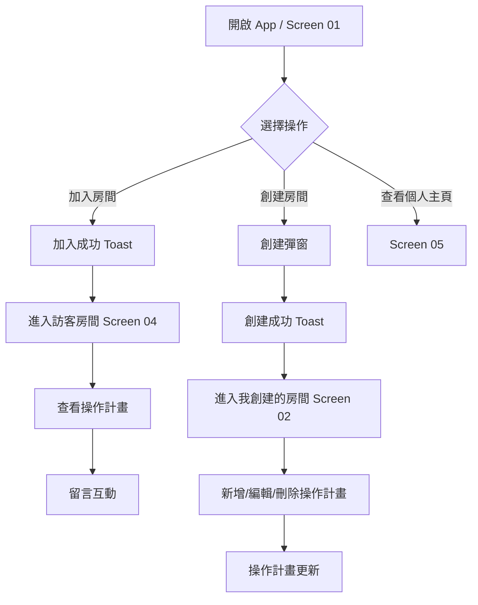

# PRD 產品需求文件 — 股神俱樂部功能頁

## 一、PRD for UI
### 1. 功能名稱＆簡介
**功能名稱：** 股神俱樂部 APP 功能頁（房間社群 + 操作計畫）  
**簡介：** 提供房間總覽、加入/創建房間、操作計畫管理、留言互動與個人主頁的單頁式 App UI 原型，模擬完整使用流程。

### 2. 目標用戶
- 對投資主題社群有需求的使用者
- 需透過「房間」形式聚合投資計畫、追蹤他人策略的使用者
- 需要簡易分享/留言功能的操作計畫協作成員

### 3. 用戶需求
- 快速瀏覽可加入的房間並立即進入房間內容
- 在自己房間建立操作計畫並管理（新增/編輯/刪除）
- 對操作計畫留言互動
- 清楚看到自己創建與加入的房間清單
- 行動裝置上順暢的固定導覽與內容捲動體驗

### 4. 如何驗證用戶有此需求/問題
- 使用者訪談：投資社群希望在單一畫面快速切換房間、看策略摘要
- 行為觀察：高頻使用「加入房間 → 立即查看內容 → 留言」流程
- 可用性測試：檢驗固定 Header / 底部導覽是否影響可讀性與操作效率

### 5. 功能概述
- Screen 01：房間總覽（可加入/排序）
- Screen 02：我創建的房間（操作計畫管理）
- Screen 03：我加入的房間（快速進入）
- Screen 04：房間頁-訪客（查看計畫/留言/退出）
- Screen 05：個人主頁（暱稱、創建/加入房間摘要）
- 全域：固定 Header、底部導覽、彈窗、Toast

### 6. 商業目的
- 提升社群互動與房間活躍度
- 促進使用者留存與回訪（透過操作計畫更新與留言互動）
- 為後續付費房間或進階數據服務鋪路

### 7. 成功指標
- 房間加入轉換率（查看總覽 → 加入）
- 操作計畫建立率（創建房間 → 新增計畫）
- 互動率（留言/每房間平均留言數）
- 7 日留存率、房間回訪率

---

## 二、產品功能與說明
### 1. Workflow
1. 進入 App（預設 Screen 01）
2. 瀏覽房間總覽 → 加入房間 → 立即進入訪客房間頁
3. 在房間頁查看操作計畫與留言
4. 切換到「我創建的房間」管理自己的操作計畫
5. 透過底部分頁或 Header 快速切換頁面
6. 在個人主頁檢視自己的房間資訊

### 2. Flow Chart

### 3. Wireframe
- **Header：** 左側為「股神俱樂部」標題（回首頁），右側包含「創建房間」與頭像按鈕。
- **底部導覽列：** 房間總覽 / 我創建的房間 / 我加入的房間
- **內容區：** 以卡片呈現房間與操作計畫；操作計畫卡片含欄位摘要與互動按鈕
- **彈窗：** 創建房間、操作計畫表單、留言、確認刪除/移除/退出

### 4. 功能說明_用戶端＆系統端
**用戶端：**
- 在【房間總覽】中，用戶在【排序/加入房間】下，可以【加入房間並立即查看內容】，才能達成【快速進入社群策略內容】的目標。
- 在【我創建的房間】中，用戶在【新增/編輯/刪除操作計畫】下，可以【管理策略細節並更新操作計畫】，才能達成【持續維護房間策略內容】的目標。
- 在【房間頁-訪客】中，用戶在【留言互動】下，可以【對操作計畫留言】，才能達成【與房主交流與回饋】的目標。
- 在【個人主頁】中，用戶在【房間摘要】下，可以【檢視自己創建與加入的房間】，才能達成【快速回到常用房間】的目標。

**系統端：**
- 維護房間與成員關係：加入/退出時同步更新成員數。
- 操作計畫 CRUD 與留言寫入：提供新增/編輯/刪除/讀取 API。
- 導覽與互動回饋：在關鍵操作顯示 Toast 與彈窗。

### 5. 後端需求（API 規劃等等）
**核心資源：** users、rooms、room_members、operations、operation_comments

**API 範例：**
- `GET /rooms?excludeOwned=true&sort=member_desc`
- `POST /rooms`（創建房間）
- `GET /rooms/owned` / `GET /rooms/joined`
- `POST /rooms/:id/join` / `POST /rooms/:id/leave`
- `GET /rooms/:id`
- `POST /rooms/:id/operations` / `PATCH /operations/:id` / `DELETE /operations/:id`
- `POST /operations/:id/comments`

**資料欄位建議（操作計畫）：**
- stock_code, stock_name, plan_date
- position_pct, entry_condition, entry_range_min, entry_range_max
- add_condition, stop_loss_condition, take_profit_condition
- target_price, note
